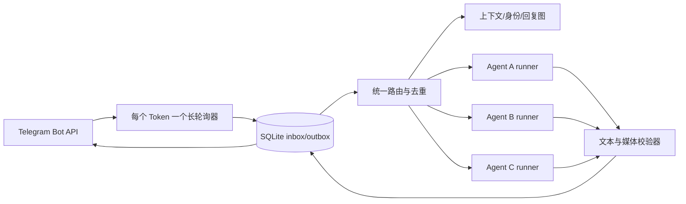

# Telegram 多智能体桥接方案

这是从我们实际运行的 Telegram 多智能体桥中剥离出的通用开源版。它解决的不是“让一个 Bot 回一句话”，而是让多个独立 Agent 在私聊和群聊中长期、稳定、安全地工作。

> 本目录包含可运行源码、安装脚本、配置模板、离线测试和设计文档，不包含 Bot Token、用户 ID、私人记忆、真实聊天记录或各模型厂商的登录凭据。

## 快速试跑

需要 Linux 和 Python 3.11+。先复制并填写示例中的 Bot Token 与 numeric ID：

```bash
cp examples/bridge.env.example .env
cp examples/config.example.json config.json
set -a; . ./.env; set +a
PYTHONPATH=src BRIDGE_CONFIG_PATH=./config.json python3 -m sutang_telegram_bridge
```

示例配置连接三个回声 Agent，方便先验收 Telegram 通道。接入真实 Agent 时，把 `command` 换成一个“从 stdin 读取提示词、只把最终答案写到 stdout”的固定 wrapper。正式安装使用一条短命令：

```bash
sudo ./scripts/install.sh
```

安装后填写 `/etc/sutang-telegram-bridge/bridge.env` 和 `config.json`，再启动服务。运行离线测试：

```bash
python3 -m unittest discover -s tests -v
```

## 完整功能清单

### 聊天与路由

- 支持一个常驻桥接服务同时管理多个 Telegram Bot 和独立 Agent。
- 支持所有者与各 Agent 进行私人对话。
- 支持配置内 Bot 之间进行隔离的 group-safe 私聊。
- 支持 Agent 在 Telegram 群聊和 Topic 中工作。
- 支持 `adaptive`、`full`、`mentions`、`muted` 四种群聊响应模式。
- 支持通过 `@Bot`、Reply、别名和命令精准唤醒指定 Agent。
- 支持保留发送者 numeric ID、用户名、显示名、回复关系和 Topic ID。
- 支持使用 Telegram 原生 typing 状态并一次性发送最终答案。
- 支持长文本清理和自动安全分段。
- 可选为支持 resume 的 Agent 按 `Agent + 群 + Topic` 保存独立 provider session；
  后续调用只补交成功游标之后仍在有界缓冲区中的增量消息。

### 多 Agent 协作

- 支持 Telegram Bot API 10.0 原生 bot-to-bot 通信。
- 支持使用 Telegram 返回的 numeric bot ID 验证 Bot 身份。
- 支持其他 Agent 被唤醒前读取同群、同 Topic 的被动上下文。
- 支持通过 `/team` 让多个 Agent 按顺序协作处理任务。
- 支持为每条人类群消息建立独立且持久化的 causal epoch。
- 支持在人类发送新消息后丢弃上一轮迟到的 Agent 输出。
- 支持通过 Bot pair 额度和群级总额度防止 Bot 无限互聊。
- 支持静默处理 `NO_REPLY` 和低价值确认回复。

### 文件与媒体

- 支持接收文字、图片、文档、GIF、贴纸、语音和音频。
- 支持安全接收并展开受限 ZIP 和 TAR 压缩包。
- 支持把 RAR 和 7z 作为普通附件交给 Agent 而不自动解压。
- 支持接入固定的本地语音转写器。
- 支持发送图片、GIF、动画和 Telegram 贴纸。
- 支持 Agent 根据语境自主发送 Reaction、贴纸和表情包。
- 支持复用当前聊天登记过的 Telegram 媒体素材。
- 支持为每个 Agent 配置受控的本地媒体库。
- 支持按所有者私聊、可信群和外部群隔离附件权限。
- 支持用作用域绑定的 `asset_id` 代替直接暴露 Telegram `file_id`。

### 所有者控制

- 支持新群加入后先由所有者审批再开始工作。
- 支持所有者把群标记为可信群或外部群。
- 支持 Agent 在所有者私聊中发起带 2–4 个按钮的操作审批。
- 支持所有者暂停或恢复某个 Agent 的全部群聊。
- 支持单独暂停或恢复某个 Agent 在指定群里的响应。
- 支持通过私聊按钮面板管理 Agent 和群聊状态。
- 支持通过 `/agent_status` 查询 Agent 当前运行模式和控制状态。
- 支持通过 `/flow_status` 查看群聊轮次和 Bot 调用额度。
- 支持通过 `/stop` 立即取消正在运行的 Agent 任务。

### 稳定性与故障恢复

- 支持将 Telegram 更新持久化到 SQLite inbox 后再推进 offset。
- 支持将待发送回复持久化到 SQLite outbox 后再调用 Telegram。
- 支持服务崩溃或重启后继续处理未完成消息。
- 增量 session 只有在 Telegram 交付完成后才提交游标；发送失败只重放 outbox，
  失效 session 自动丢弃并用完整有界上下文重试一次。
- 支持 Telegram update 去重并避免重复调用模型。
- 支持逐项记录多段文字和媒体的发送进度。
- 支持通过 `/delivery` 查看失败交付和死信记录。
- 支持通过 `/retry_update` 重新处理指定失败消息。
- 支持群聊故障时向所有者发送不含消息正文和异常正文的脱敏提醒。
- 支持所有者通过提醒按钮一键暂停发生故障的群。

### 安全与部署

- 支持每个 Agent 使用独立 Linux 用户和私人工作目录运行。
- 支持通过固定 runner 和 stdin 安全调用不同厂商的 Agent CLI。
- 支持使用固定 argv 参数和进程组降低命令注入风险。
- 支持只从环境变量读取 Bot Token 和其他凭据。
- 支持对 bot-to-bot 输入输出中的访问材料进行脱敏。
- 支持日志隐藏 Token、消息正文、完整 prompt 和异常正文。
- 支持将外部群与所有者私聊记忆、私人文件和系统操作隔离。
- 支持通过安装脚本和 systemd 部署为常驻服务。
- 支持使用配置模板快速连接多个真实或测试 Agent。
- 支持运行不会访问真实 Telegram 聊天的离线测试。

## 架构



桥本身使用低权限账号 `sutang-bridge`。它不能直接读取 Agent 的私人仓库，只能通过 root 所有、路径固定的 runner，以不同 Linux 用户启动各自 CLI。提示词走 stdin，进程参数使用 argv 数组，绝不拼接 shell 字符串。

## 源码结构

```text
src/sutang_telegram_bridge/
├── bridge.py       # 多 Bot 路由、讨论、typing、取消与交付
├── telegram.py     # 零依赖 Telegram Bot API 客户端
├── store.py        # SQLite inbox/outbox、上下文与媒体资产
├── attachments.py # 下载、限额与 ZIP/TAR 安全展开
├── media.py        # 图片/GIF/贴纸输出协议及作用域检查
├── identity.py     # 回复图身份 envelope 与误合并守卫
├── approval.py     # 所有者私聊审批按钮、严格载荷校验
├── privacy.py      # bot-to-bot 输入输出的访问材料脱敏
├── transcription.py # 固定命令、无 shell 的可选语音转写
├── runner.py       # 无 shell 的 Agent 子进程和进程组取消
└── config.py       # JSON 配置校验，Token 只从环境读取
```

`tests/` 全部使用假 Telegram 客户端或本地临时文件，不会给真实聊天发送消息。

## 运行时控制

- `/agent_on`：当前群切到 `adaptive`
- `/agent_off`：当前群切到 `mentions`
- `/agent_mute`：当前群完全静音
- `/agent_mode adaptive|full|mentions|muted`：精确切换
- `/agent_pause@bot` / `/agent_resume@bot`：暂停或恢复该 Agent 的全部群聊，私聊保留
- `/agent_switch`：在该 Agent 私聊打开总开关与逐群按钮面板
- `/agent_pause_group <chat_id>` / `/agent_resume_group <chat_id>`：私聊中逐群控制
- `/agent_status`：查看当前动态状态
- `/groups` / `/pending_groups`：私聊查看群清单或补发待审批卡
- `/delivery` / `/retry_update <update_id>`：私聊查看死信或重新入队
- `/flow_status`：所有者在群内查看当前 epoch、整轮 Bot 调用数和滚动 pair 额度；查询本身不新建 epoch

群内未带 `@bot` 的控制命令由默认 Agent 认领一次，避免多个 Bot 重复执行。以上命令仅所有者 ID 有效。

## 最小落地顺序

1. 用 BotFather 创建 Bot；为需要互相通信的 Bot 开启 Bot-to-Bot Communication Mode。私聊要求发送方和接收方都开启；群内接收未点名的 Bot 消息还要求接收 Bot 是管理员或关闭 Group Privacy Mode。设置变更后按 BotFather 提示重新加入群。
2. 为桥和每个 Agent 创建独立 Linux 用户，准备固定 runner。
3. 将 Token、所有者 ID、群 ID 写入 root-only 环境文件，权限设为 `0600`。
4. 创建附件、数据库和媒体目录，按本文的权限边界授权。
5. 安装 systemd 服务，确认同一 Token 只有一个 `getUpdates` 消费者。
6. 先跑离线测试，再在测试私聊、测试群和 Telegram Topic 中做验收。

具体操作见 [安装与配置](docs/INSTALLATION.md)。实际故障按 [痛点对照表](docs/PAIN-POINTS.md) 和 [排障手册](docs/TROUBLESHOOTING.md) 查。

## 文档导航

- [架构与消息生命周期](docs/ARCHITECTURE.md)
- [安装与配置](docs/INSTALLATION.md)
- [真实痛点与解决办法](docs/PAIN-POINTS.md)
- [图片、GIF、贴纸、文档与压缩包](docs/MEDIA-AND-FILES.md)
- [安全与权限边界](docs/SECURITY.md)
- [排障与验收](docs/TROUBLESHOOTING.md)
- [Agent wrapper 接口](docs/AGENT-ADAPTERS.md)
- [审批按钮与适配器边界](docs/APPROVALS.md)
- [所有者控制台、新群审批与故障恢复](docs/OPERATOR-CONTROLS.md)

## 明确的边界

- Bot-to-bot 传输使用 [Telegram Bot API 10.0](https://core.telegram.org/bots/api#may-8-2026) 的原生能力，不由桥复制消息、伪造 sender 或借助中转账号。私聊发送可调用 `send_bot_text("@TargetExampleBot", text)`；双方都必须在 BotFather 开启 Bot-to-Bot Communication Mode。
- 群内 Bot 消息只在它用原生 `/command@TargetBot` 定向当前 Bot 或直接回复当前 Bot 时唤醒 Agent。Telegram 可能把更多未点名 Bot 消息交给关闭 Group Privacy Mode 或具有管理员权限的接收 Bot，但本桥仍默认静默，避免广播式连锁唤醒。
- 收到的 Bot 必须是启动时通过 `getMe` 获得 numeric ID 的已配置 peer；用户名、昵称和消息正文不能冒充身份。Bot 私聊使用 group-safe runner，不进入所有者私聊工作目录，不执行所有者命令、审批、附件或持久记忆写入。
- 同一对 Bot 默认在滚动 120 秒内最多触发 4 次 Agent 调用，方向和聊天表面不影响计数。预算在调用前写入 SQLite，重启仍有效；失败、低价值确认和 `NO_REPLY` 同样消耗预算。
- 单个群聊 causal epoch 默认最多触发 8 次 Bot 模型调用。新的人类消息开启下一 epoch；旧 epoch 尚未完成的 Bot 输出会在发送前静默丢弃。
- 群内可见的 Agent 文本会成为其他配置内 Agent 的被动上下文；被动写入不运行模型、不发送 Telegram 消息，也不获得所有者权限。
- `/team` 仍可作为所有者主动选择的确定性编排：桥把各 Agent 结果作为被动上下文依次传递，轮数有硬上限。它不再是 bot-to-bot 的传输替代品，也不会伪装成 Telegram 原生 Bot 消息。
- “支持发送 GIF”不等于“Agent 可以上网找 GIF”。默认安全配置不允许群聊任意下载网络文件；应使用同一聊天中登记过的媒体或 Agent 自己的受控媒体库。
- ZIP/TAR 可以安全展开；RAR/7z 默认只作为普通文件交给 Agent，不自动解压。
- 外部群聊不应拥有私聊记忆、任意文件读取或执行系统操作的权限。
- 增量 session 不是长期记忆库，不包含私人记忆适配器；可信状态、Agent 命令或
  Topic 变化会换 session，私聊从不与群聊共用 session。
- 各厂商 CLI 参数不同，仓库提供稳定 wrapper 协议而不内置登录凭据；部署者需把自己的非交互命令接到固定 runner。
- 语音转写同样采用固定 wrapper；仓库不捆绑模型权重或云端语音 API Key。未配置转写器时，语音仍会作为附件交给 Agent，但不会伪称已经识别。
- Telegram 发送接口没有客户端幂等键。桥会逐项保存交付进度，但若进程恰好在“Telegram 已接受、SQLite 尚未确认”的极短窗口崩溃，仍可能重复最后一项；不会因此再次调用 Agent。

相关 Telegram 官方说明：[Bot FAQ](https://core.telegram.org/bots/faq)、[Bot API](https://core.telegram.org/bots/api)。

## 许可证

本目录内容采用 [MIT License](LICENSE)。
